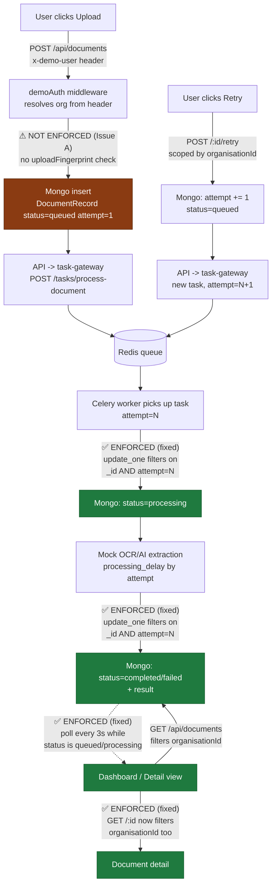
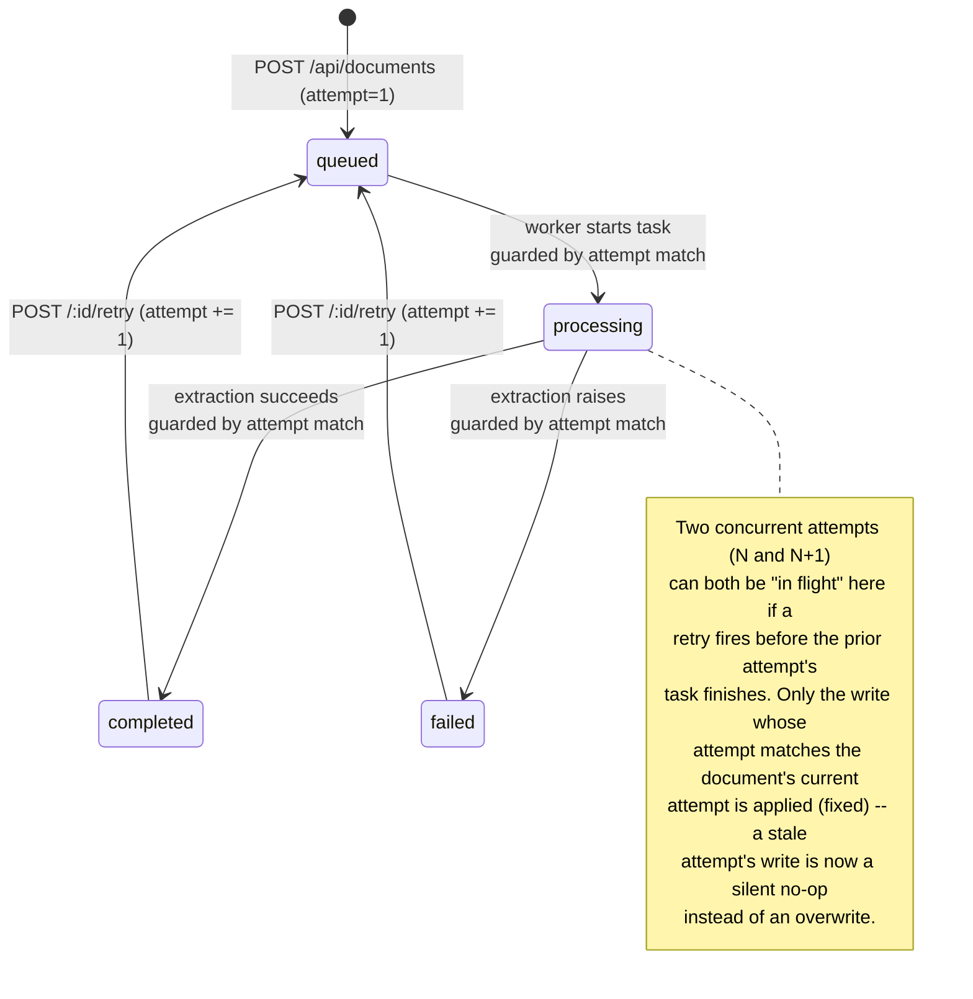

# Dependency map — document upload / processing / status workflow

Scope: only the path exercised by the three reported symptoms (upload → API →
Mongo → task-gateway → Redis → Celery worker → Mongo → UI). Enforcement points
are marked as they exist **after** the Issue C and Issue B fixes in this
submission; Issue A (idempotency) is marked as still missing, since it is
documented but not fixed here.

## State transitions (per document)

## Enforcement points, called out explicitly

| Boundary | What must be enforced | Status in this submission |
| --- | --- | --- |
| `POST /api/documents` → Mongo insert | Idempotency (same org+content shouldn't create 2 jobs) | ❌ **Missing** — Issue A, documented not fixed. `uploadFingerprint` is computed but never checked. |
| `GET /api/documents/:id` → Mongo read | Tenant scope (org must match requester) | ✅ **Fixed** (Issue C) — now filters `organisationId`, returns 404 on mismatch instead of leaking the record. |
| `POST /:id/retry` → Mongo update | Tenant scope | ✅ Was already enforced; unchanged. |
| Worker `update_one` (processing / completed / failed) | Retry/attempt monotonicity (a stale in-flight task must not overwrite a newer attempt's state) | ✅ **Fixed** (Issue B2) — write is now conditioned on `{_id, attempt}` matching the task's own attempt. |
| Terminal states (`completed`, `failed`) | Once terminal, only a fresh `retry` (which bumps `attempt` and resets to `queued`) should transition the document again | ✅ Enforced by the same attempt-matched write — a task from a superseded attempt can no longer flip a document out of a newer terminal state. |
| UI (`Dashboard`, `DocumentDetail`) → API | Timely reflection of server-side state changes | ✅ **Fixed** (Issue B1) — polls while non-terminal; manual Refresh retained as a fallback. |

## Out of scope for this diagram

Authentication itself (`demoAuth`) is a stub identity resolver, not a full auth
system, and is unchanged by this work. Upload content validation (`zod` schema
on `fileName`/`content`) is enforced upstream of everything shown here and was
not found to be defective.
