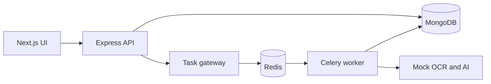

# Architecture overview

The mock adapter returns deterministic extraction results from synthetic text input. The gateway exists only to bridge the Node REST API to the existing Celery boundary. Candidates should focus on the document workflow described in the assignment.
